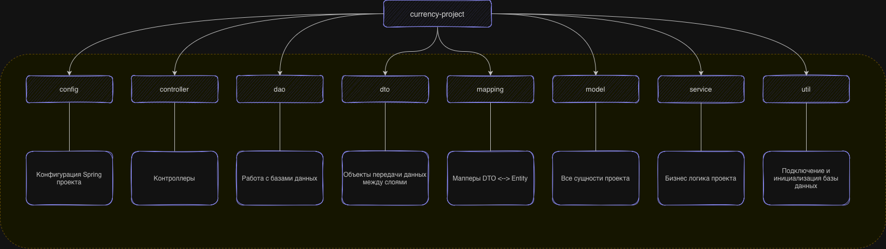

# Currency Exchange

REST API для работы с валютами и обменными курсами: добавление валют, управление курсами обмена и конвертация сумм из одной валюты в другую.

Проект построен на архитектуре (controller → service → dao) и собирается в `.war` файл.

---

## Стек технологий

| Категория | Технологии |
|-----------|------------|
| Язык / сборка | Java 17, Maven (`war`) |
| Фреймворк | Spring (Core, Context, Web, Web MVC, JDBC) `7.0.7` |
| База данных | PostgreSQL |
| Пул соединений | HikariCP |
| Маппинг DTO ↔ модель | MapStruct `1.5.5.Final` |
| Валидация | Hibernate Validator / Jakarta Validation |
| Сериализация JSON | Jackson `3.1.2` |
| Кодогенерация | Lombok |
| Servlet API | Jakarta Servlet |

---

## Структура проекта



### Валюты

| Метод | Путь | Описание | Параметры |
|-------|------|----------|-----------|
| `GET` | `/currencies` | Список всех валют | — |
| `GET` | `/currency/{code}` | Валюта по коду | `code` — код валюты (например, `USD`) |
| `POST` | `/currencies` | Добавить новую валюту | `name`, `code`, `sign` (form-urlencoded) |

### Обменные курсы

| Метод | Путь | Описание | Параметры |
|-------|------|----------|-----------|
| `GET` | `/exchangeRates` | Список всех обменных курсов | — |
| `GET` | `/exchangeRate/{currencyPair}` | Курс по валютной паре | `currencyPair` — пара кодов (например, `USDEUR`) |
| `POST` | `/exchangeRates` | Добавить новый курс | `baseCurrencyCode`, `targetCurrencyCode`, `rate` (form-urlencoded) |
| `PATCH` | `/exchangeRate/{currencyPair}` | Обновить курс пары | `rate` (form-urlencoded) |

### Обмен валюты

| Метод | Путь | Описание | Параметры |
|-------|------|----------|-----------|
| `GET` | `/exchange` | Конвертация суммы из одной валюты в другую | `from`, `to`, `amount` |

Пример: `GET /exchange?from=USD&to=EUR&amount=100`

---

## Запуск проекта

### Требования

Перед запуском убедитесь, что установлены:

- **JDK 17**
- **Maven**
- **PostgreSQL**
- **Tomcat11**

### 1. Настройка базы данных

Создайте базу данных в PostgreSQL — её имя понадобится для конфигурации.

### 2. Конфигурация

Перейдите в каталог с ресурсами и создайте рабочий файл настроек из шаблона:

```bash
cd ./currency-exchange/src/main/resources
mv application.properties.origin application.properties
```

Откройте `application.properties` и укажите параметры подключения к созданной базе:

```properties
database.URL      = jdbc:postgresql://localhost:5432/YOUR_DATABASE_NAME
db.driver         = org.postgresql.Driver
database.username = YOUR_USERNAME
database.password = YOUR_PASSWORD
```

Замените `YOUR_DATABASE_NAME`, `YOUR_USERNAME` и `YOUR_PASSWORD` на свои значения.

### 3. Сборка

Соберите проект в `.war`:

```bash
mvn clean package
```

Готовый артефакт появится в каталоге `target/` — `currency-exchange.war`.

### 4. Деплой в Tomcat

Скопируйте собранный `.war` в каталог `webapps` Tomcat под именем `ROOT.war`, чтобы приложение было доступно по корневому пути:

```bash
cp ./target/currency-exchange.war TOMCAT_HOME/webapps/ROOT.war
```

После запуска Tomcat приложение будет доступно по адресу `http://localhost:8080/`.